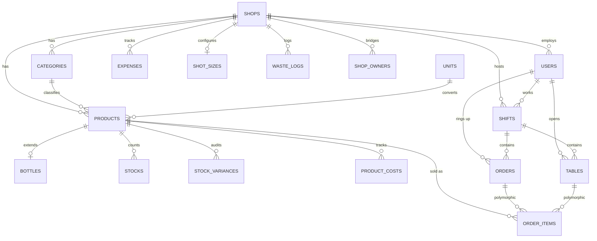

# Database Design Document: Mom&Pop POS

*Revision 6 — Comprehensive Reference Manual*

---

## 1. System Overview & Design Philosophy

Mom&Pop POS is a multi-tenant, offline-first application designed for high-performance operation in the SADC region. The architecture prioritizes data integrity and ledger immutability while ensuring that edge devices can operate without a consistent network connection.

### Key Design Principles:

* **Multi-Tenancy:** The system is partitioned by `shop_id`. Every business-critical entity (categories, products, shifts, etc.) is scoped to a specific tenant root, except for global configuration tables like `units`.
* **Offline-First Sync:** Primary keys are generated as `CHAR(36)` UUIDs on the client device. This prevents ID collisions during synchronization events between distributed terminals and the central server.
* **Polymorphic Ledgering:** Transactional line items in `order_items` utilize polymorphic relations (`orderable_type` and `orderable_id`) to attach directly to either `orders` or `tables`, eliminating the need for redundant intermediate order tables.
* **Volumetric Precision:** Inventory for bars and restaurants utilizes weight-based tracking (`tare` vs `gross` weights) in `bottles` to calculate fluid pours, ensuring precise stock variance reporting.

---

## 2. Entity-Relationship Diagram

---

## 3. Comprehensive Schema Dictionary

### 3.1 Tenant Root & Personnel

| Table | Field | Type | Notes |
| --- | --- | --- | --- |
| **`shops`** | `id` | CHAR(36) PK | Tenant Root |
|  | `name` | VARCHAR(255) |  |
|  | `shop_type` | VARCHAR(255) |  |
|  | `latitude`/`longitude` | DECIMAL | Geofence coordinates |
| **`users`** | `id` | CHAR(36) PK |  |
|  | `shop_id` | CHAR(36) FK | Nullable (Owner/Admin support) |
|  | `role` | VARCHAR(255) |  |
|  | `pin` | VARCHAR(255) | Staff PIN access |
| **`shop_owners`** | `id` | BIGINT PK | Equity partner bridge |
|  | `shop_id`/`user_id` | CHAR(36) FK |  |

### 3.2 Inventory, Costing & Volumetrics

| Table | Field | Type | Notes |
| --- | --- | --- | --- |
| **`categories`** | `id` | CHAR(36) PK |  |
| **`products`** | `id` | CHAR(36) PK | Master catalog |
|  | `cost_price` | DECIMAL(10,2) |  |
| **`product_costs`** | `id` | CHAR(36) PK | Historical unit cost tracking |
|  | `unit_cost` | DECIMAL(10,2) |  |
| **`bottles`** | `id` | CHAR(36) PK | 1:1 Product Extension |
|  | `tare_weight_g` | DECIMAL |  |
|  | `gross_weight_g` | DECIMAL |  |
| **`stocks`** | `id` | CHAR(36) PK |  |
|  | `quantity` | DECIMAL(10,3) | Fractional support |
| **`stock_variances`** | `id` | CHAR(36) PK | Audit trail |

### 3.3 Transactions & Ledger

| Table | Field | Type | Notes |
| --- | --- | --- | --- |
| **`shifts`** | `id` | CHAR(36) PK | Timeline boundaries |
|  | `actual_cash` | DECIMAL(10,2) | Blind cash-up field |
| **`orders`** | `id` | CHAR(36) PK | Counter transaction |
| **`tables`** | `id` | CHAR(36) PK | Running hospitality tab |
| **`order_items`** | `id` | CHAR(36) PK | Polymorphic ledger |
|  | `orderable_type` | VARCHAR | Order or Table class |
|  | `orderable_id` | CHAR(36) | Parent reference |

### 3.4 Audit & Config

| Table | Field | Type | Notes |
| --- | --- | --- | --- |
| **`waste_logs`** | `id` | CHAR(36) PK | Spoilage/Breakage ledger |
| **`expenses`** | `id` | CHAR(36) PK |  |
| **`shot_sizes`** | `id` | CHAR(36) PK | Volumetric config |

---

## 4. Structural Audit & Correction Roadmap

To ensure the system matches the documented design philosophy, the following technical corrections are required for your implementation:

1. **Enforce Ledger Immutability:** Update FK constraints on `orders`, `order_items`, and `tables` from `ON DELETE CASCADE` to `ON DELETE RESTRICT` (or soft-deletes). This prevents the "blast radius" issue where deleting a user or shop would inadvertently purge financial history.
2. **Unify Stock Constraints:** Add a `UNIQUE` index on `stocks.product_id` to strictly enforce the "one-row-per-product" structural counter requirement.
3. **Expand Pour Logic:** Modify `shot_sizes` or the application logic to allow multiple pour size options per venue, as the current unique constraint on `shop_id` limits the system to a single size per shop.
4. **JSON Metadata:** Migrate `order_items.metadata` from `VARCHAR(255)` to a `JSON` type to support more robust, scalable attribute storage for sales modifiers.
5. **Documentation Sync:** Explicitly define the polymorphic `order_items` pattern in the `system_overview.md` to ensure future contributors do not look for a `current_order_id` column on the `tables` table that does not exist.

---

## 5. Infrastructure & Framework

Standard Laravel framework tables (`cache`, `jobs`, `failed_jobs`, `migrations`, `personal_access_tokens`, `sessions`) are maintained within the schema to support application-level features like queuing and session management. These do not participate in the business logic defined in the sections above and are excluded from the domain audit trails.