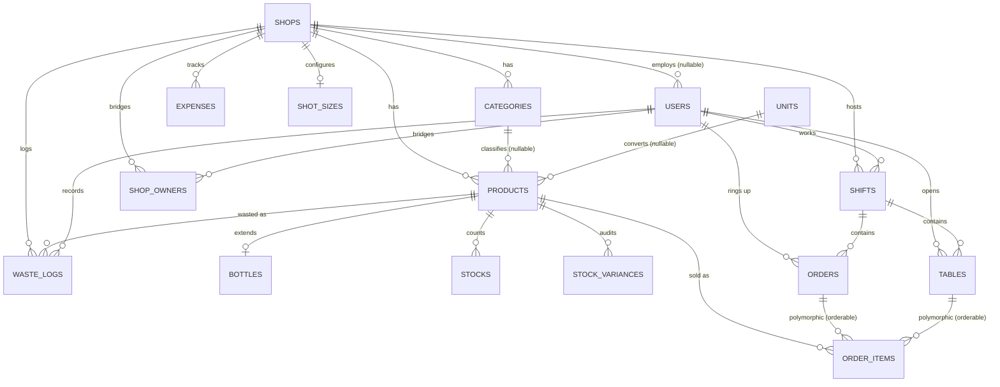

# Mom&Pop POS — Database Design Document
*Generated from `mom_popDB.sql` (MySQL Workbench forward-engineering script, schema `mom&pop`)*

---

## 1. Overview

Mom&Pop POS is a multi-tenant POS system for small shops, bars, and restaurants. Every domain table hangs off a `shops` row (directly or through a parent), and every record uses a `CHAR(36)` UUID primary key generated client-side, consistent with the offline-first sync strategy described in the system overview. Laravel's own framework tables (`cache`, `jobs`, `sessions`, `personal_access_tokens`, etc.) are included in the dump but aren't part of the business domain — they're listed briefly at the end for completeness.

---

## 2. Entity-Relationship Diagram

> Note: `order_items` doesn't have a hard FK to `orders` or `tables`. It uses a Laravel-style **polymorphic relation** (`orderable_type` + `orderable_id`), which is how a single line-item table can belong to either a quick-sale `order` or a running `table` tab. This is enforced in application code, not by the database — see §5 for the implication.

---

## 3. Core Domain Tables

### 3.1 `shops` — Tenant Root
The top of the tenancy tree. Every other domain table is scoped to a shop, directly or transitively.

| Column | Type | Notes |
|---|---|---|
| `id` | CHAR(36) PK | UUID |
| `name` | VARCHAR(255) | |
| `shop_type` | VARCHAR(255) | e.g. retail vs. bar/restaurant |
| `latitude` / `longitude` | DECIMAL(10,8)/(11,8) | Geofence center |
| `allowed_radius` | INT | Geofence radius for shift check-in |

### 3.2 `users` — Staff Accounts
| Column | Type | Notes |
|---|---|---|
| `shop_id` | CHAR(36), **nullable**, FK → `shops.id` ON DELETE CASCADE | Nullable so multi-shop owners aren't pinned to one storefront |
| `role` | VARCHAR(255), default `'cashier'` | No enum constraint at the DB level — role values are free text |
| `pin` | VARCHAR(255), nullable | Likely for PIN-based cashier login on the terminal |
| `email` | nullable, unique | Owners/managers probably use email; cashiers may only get a PIN |

⚠️ One thing to double check: `users.shop_id` is `ON DELETE CASCADE`. Deleting a shop will delete every user record tied to that shop, including historical shift/order authorship data tied to `user_id` elsewhere. If a user is ever deleted this way, any `orders`, `shifts`, `tables`, or `waste_logs` rows referencing that `user_id` will also cascade-delete (see §5.1) — that's a bigger blast radius than "delete a shop" probably should have on a ledger-first system.

### 3.3 `shop_owners` — Owner ↔ Shop Bridge (many-to-many)
| Column | Type | Notes |
|---|---|---|
| `id` | BIGINT AUTO_INCREMENT PK | Only auto-increment PK in the domain tables (rest are UUID) |
| `shop_id` / `user_id` | FK, both `ON DELETE CASCADE` | Unique composite (`shop_id`, `user_id`) — one link per pairing |

Lets one `user` (an owner) be linked to many `shops`, and one `shop` have multiple co-owners — matches the multi-store/equity-partner story in the overview.

### 3.4 `categories`
| Column | Type | Notes |
|---|---|---|
| `shop_id` | FK → `shops`, CASCADE | Unique on (`shop_id`, `slug`) — slugs are unique per shop, not globally |

### 3.5 `units` — Unit Conversion Table
| Column | Type | Notes |
|---|---|---|
| `conversion_rate` | DECIMAL(10,3) | e.g. six-pack → single unit |
| `type` | VARCHAR(255), default `'unit'` | |

Not scoped to a shop — units appear to be a shared/global reference table, not per-tenant.

### 3.6 `products` — Master Catalog
| Column | Type | Notes |
|---|---|---|
| `shop_id` | FK → `shops`, CASCADE | |
| `category_id` | FK → `categories`, nullable, **SET NULL** on delete | |
| `unit_id` | FK → `units`, nullable, **SET NULL** on delete | |
| `cost_price` / `selling_price` | DECIMAL(10,2) | |
| `is_perishable` | TINYINT(1) | |

Unique on (`shop_id`, `name`) — no duplicate product names within one shop.

### 3.7 `bottles` — Hospitality Volumetrics (1:1 extension of `products`)
| Column | Type | Notes |
|---|---|---|
| `product_id` | FK → `products`, CASCADE, **UNIQUE** | Unique constraint makes this a true 1:1 extension table |
| `capacity_ml`, `tare_weight_g`, `gross_weight_g` | INT | Feeds the weight→volume pour-variance calc from the overview |
| `bottle_selling_price` | DECIMAL(10,2), nullable | Separate sell price for the whole bottle vs. by-the-shot |

### 3.8 `stocks` — On-Hand Counters
| Column | Type | Notes |
|---|---|---|
| `product_id` | FK → `products`, CASCADE | **Not unique** — no DB-level guarantee of one stock row per product |
| `quantity_on_hand`, `count` | DECIMAL(10,3) | Two separate fields — likely "system count" vs. "physical count" for reconciliation |

⚠️ Overview §5.11 describes this as "a single explicit structural counter" per product, but the schema doesn't enforce that with a unique index the way `bottles` does. Worth adding `UNIQUE (product_id)` if that's the intended design, or clarifying if multiple stock rows per product (e.g. per-batch) are intentional.

### 3.9 `stock_variances` — Variance Audit Trail
| Column | Type | Notes |
|---|---|---|
| `product_id` | FK → `products`, CASCADE | |
| `variance` | DECIMAL(10,3) | Signed — over/under count |
| Index on (`product_id`, `created_at`) | | Optimized for "variance history over time per product" queries |

### 3.10 `shot_sizes`
| Column | Type | Notes |
|---|---|---|
| `shop_id` | FK → `shops`, CASCADE, **UNIQUE** | |
| `size_ml` | INT | |

⚠️ The unique index on `shop_id` means **one shot size per shop**, not a set of options. The overview text ("standard 25ml or 30ml options") implies a shop should be able to offer multiple pour sizes — as built, a shop can only ever have a single `shot_sizes` row. If you want multiple pour options per venue, this table needs the unique constraint dropped (or turned into a proper one-to-many).

### 3.11 `expenses`
| Column | Type | Notes |
|---|---|---|
| `shop_id` | FK → `shops`, CASCADE | |
| `type` | ENUM(`fixed`, `salary`, `variable`) | DB-level enum, unlike `users.role` which is free text |
| Index on (`shop_id`, `type`) | | |

### 3.12 `waste_logs` — Write-Off Audit Trail
| Column | Type | Notes |
|---|---|---|
| `shop_id`, `product_id`, `user_id` | FKs, **no ON DELETE clause** (defaults to RESTRICT) | Correctly protected — can't delete a shop/product/user out from under a waste record |
| `quantity` | DECIMAL(10,3) | |
| `reason` | TEXT | |

---

## 4. Operational / Transaction Tables

### 4.1 `shifts`
| Column | Type | Notes |
|---|---|---|
| `shop_id`, `user_id` | FKs, **no ON DELETE clause** (RESTRICT) | Correctly immutable per the ledger-first rule |
| `opened_at` | TIMESTAMP NOT NULL | |
| `closed_at` | nullable | Open shift = `closed_at IS NULL` |
| `blind_cash_reported`, `blind_ecocash_reported`, `blind_swipe_reported`, `blind_onemoney_reported` | DECIMAL(10,2), nullable | The cashier's blind count fields described in the overview |

### 4.2 `orders`
| Column | Type | Notes |
|---|---|---|
| `shift_id` | FK → `shifts`, **CASCADE** | |
| `user_id` | FK → `users`, **CASCADE** | |
| `total_amount` | DECIMAL(10,2), default 0.00 | |
| `payment_method` | VARCHAR(255), nullable | Free text, not an enum |
| `status` | VARCHAR(255) NOT NULL | Free text, not an enum (overview mentions `open`/`closed` as example values) |

⚠️ This is the one that stands out most: §4.1 of the overview calls `orders`/`order_items`/`shifts` out by name as ledger tables that should **exclude cascade deletes** to "safeguard financial tracking profiles... and preserve historical accounting integrity." `shifts` follows that rule (no ON DELETE clause). `orders` does not — both its FKs (`shift_id`, `user_id`) are `ON DELETE CASCADE`. As built, deleting a shift or a user will silently delete all of that shift's/user's orders. Worth revisiting against the stated design rule.

### 4.3 `order_items`
| Column | Type | Notes |
|---|---|---|
| `orderable_type` / `orderable_id` | VARCHAR(255) / CHAR(36) | Polymorphic pointer — no DB FK, resolved in app code to either `Order` or `Table` |
| `product_id` | FK → `products`, **CASCADE** | |
| `quantity` | DECIMAL(10,3) | Fractional-unit support as described in §4.2 of the overview |
| `unit_price`, `subtotal` | DECIMAL(10,2) | |
| `metadata` | VARCHAR(255) NOT NULL | Likely JSON-in-a-string for modifiers/notes — consider `JSON` or `TEXT` type if it can grow |

⚠️ Two things worth flagging together:
1. Because `orderable_id` isn't a real foreign key, the database can't enforce referential integrity between a line item and its parent order/tab — a bug in app code could leave orphaned or misattributed `order_items` with nothing catching it at the DB layer.
2. `product_id` is `ON DELETE CASCADE`. Since `order_items` is itself part of the immutable ledger, deleting a product would delete historical sales line items along with it — the same "should this cascade?" question as `orders` above.

### 4.4 `tables` — Hospitality Running Tabs
| Column | Type | Notes |
|---|---|---|
| `shift_id`, `user_id` | FKs → `shifts`/`users`, both **CASCADE** | |
| `total_amount` | DECIMAL(10,2), default 0.00 | |
| `status` | VARCHAR(255), default `'open'` | |

⚠️ The overview (§5.5) describes `tables` as having a nullable `current_order_id` pointer into `orders`. That column **isn't in the actual schema** — instead, the polymorphic `order_items.orderable_type/orderable_id` lets a `table` own line items directly, without needing an intermediate `orders` row at all. This looks like the design evolved (tabs accumulate items directly rather than pointing at a live order), but it's worth updating the overview doc so it matches what's actually built — otherwise a future contributor will go looking for a column that doesn't exist.

---

## 5. Cross-Cutting Notes

### 5.1 Cascade Behavior Summary

| Table | FK | On Delete | Matches "ledger tables don't cascade" rule? |
|---|---|---|---|
| `shifts` → shops/users | both | *(none — RESTRICT)* | ✅ |
| `orders` → shifts/users | both | CASCADE | ❌ |
| `order_items` → products | | CASCADE | ❌ |
| `tables` → shifts/users | both | CASCADE | ❌ |
| `waste_logs` → shops/products/users | all | *(none — RESTRICT)* | ✅ (audit trail correctly protected) |
| `users` → shops | | CASCADE | — (not a ledger table itself, but cascades *into* ledger tables via `user_id`) |

Net effect: deleting a `shop` will cascade through `users` → and from there cascade-delete that user's `orders` and `tables`, which is a much wider blast radius than the "ledger-first immutability" principle in your own design doc calls for. If hard deletes of shops/users are meant to be rare admin actions, this might be fine in practice — but if you want the DB to actually *guarantee* ledger immutability (per §4.1 of the overview), the `orders`, `order_items`, and `tables` foreign keys are the ones to change from CASCADE to RESTRICT (or add soft-deletes instead of relying on FK behavior).

### 5.2 UUID Consistency
Every domain table uses `CHAR(36)` UUID PKs generated client-side, matching the sync strategy in the overview — except `shop_owners` (auto-increment BIGINT) and the standard Laravel infra tables (`jobs`, `failed_jobs`, `migrations`, etc.), which is expected since those aren't part of the offline-sync edge model.

### 5.3 Missing from the Schema vs. the Overview
- `tables.current_order_id` — not present (see §4.4)
- Multiple pour sizes per shop — `shot_sizes` currently allows only one row per shop (see §3.10)
- `shops.shop_owners`-style equity language matches; no discrepancy there

---

## 6. Framework/Infrastructure Tables
Standard Laravel scaffolding, not part of the business domain: `cache`, `cache_locks`, `failed_jobs`, `jobs`, `job_batches`, `migrations`, `password_reset_tokens`, `personal_access_tokens`, `sessions`. Included in the dump because they live in the same schema, but they don't participate in tenant/business relationships.

---

## 7. Suggested Follow-Ups
1. Decide whether `orders`, `order_items`, and `tables` should switch to RESTRICT (or soft-deletes) to actually match the ledger-immutability principle you've documented.
2. Add a unique constraint on `stocks.product_id` if one stock row per product is the intent.
3. Drop or rework the unique constraint on `shot_sizes.shop_id` if multiple pour sizes per venue is a real requirement.
4. Either add `tables.current_order_id` or update `system_overview.md` to describe the polymorphic `order_items` pattern that's actually implemented.
5. Consider whether `order_items.metadata` should be a proper `JSON` column rather than `VARCHAR(255)`.